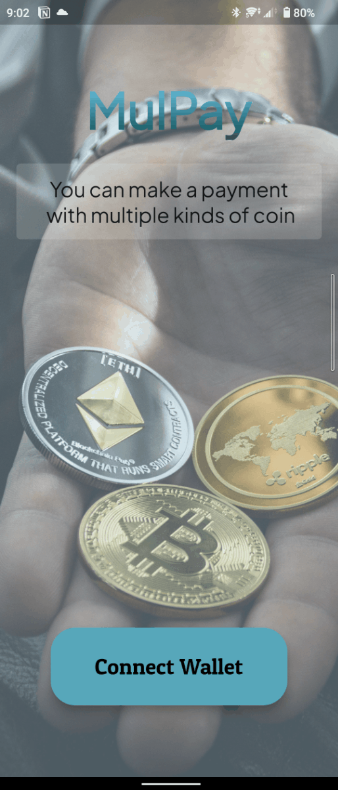

<p align="center">
  <br />
  
  <br/>
  <br />
  <p align="center">


</p>

<br/>

[](#table-of-contents)

<br/>

## • Overview

I made this project and its text by myself. This project's text is [here](https://app.unchain.tech/learn/NEAR-MulPay/) used in engineer cmmunity `UNCHAIN`. This one is one of the best one to learn blockchain development.

This is a dapp that you can send your tokens to others. The uniquness is that you can send your tokens with swapping. Also, you can get address through QR code scan.

## • Frontend GIF

[](https://eth-dapp-three.vercel.app/)

## • Launch

1. run `yarn install` in terminal.

2. Run `flutter pub get` at `package/client` in terminal.

3. make `.env` file under `packages/contract` and input your `Private Key` like below.

```
AURORA_PRIVATE_KEY=YOUR_PRIVATE_KEY
```

4. run `yarn contract deploy` in terminal. The result would be like below.

```
deployer address is 0x04CD057E4bAD766361348F26E847B546cBBc7946
Swap Contract is deployed to: 0xf996aa3a3b8376Ec9319CfBFD22503a623415cc0
DaiToken is deployed to: 0xf3b9D53211D98b55aa45a5AbfB10CdD6D0BC159C
EthToken is deployed to: 0x6D48d3A9E2C91b93e6F894f88FdDD0E86217a95e
AoaToken is deployed to: 0xce793fc449B84614d85Ba96e3F928a3701F83A92
ShibToken is deployed to: 0xF5fef8fC61744B288CeC939079bb2B0980Ea4E8C
SolToken is deployed to: 0x8d07C46d0d3DC169a1DB7F07AE1df4b67f513529
UsdtToken is deployed to: 0x9d22caddaf41E3987C2dEE13Dc893A4bc653E756
UniToken is deployed to: 0x85C5207D2B8e9855637a0fe7544704B56d4789Ac
MaticToken is deployed to: 0x043f7895B9bd9972db2dE164D9F38963EAADA2F6
```

5. Create `.env` file under `packages/client` and rewrite the valuables like this.

```javascript
AOA_CONTRACT_ADDRESS = '0x10Fc0df445Cc2be44Af50C008a83248b26228Df4';
SHIB_CONTRACT_ADDRESS = '0x53541b23074e4E14AE32f02aFc299E1990590D44';
ETH_CONTRACT_ADDRESS = '0x78C4F9eBF32E2a02Cd0dAE561DD0FAFF7bA64b9a';
SOL_CONTRACT_ADDRESS = '0xb2C9AA59BE1ba9bfda60EEa8a40d57aA08A8A49b';
USDT_CONTRACT_ADDRESS = '0x0004976DD6E9Bf9148d46706845962A5AD5F429e';
UNI_CONTRACT_ADDRESS = '0x9528bf0F166f0f167cbb1e028Ba951852e83927a';
MATIC_CONTRACT_ADDRESS = '0xE91fAD00f61076f9274e1656f263597B6ddA090D';
DAI_CONTRACT_ADDRESS = '0x7363F3bBf35fda8E14C98794EAc4196DbeDc76cC';
SWAP_CONTRACT_ADDRESS = '0x734156aE604355bEc16762168994bEb09b899da7';

SWAP_CONTRACT_NAME = 'SwapContract';
DAI_CONTRACT_NAME = 'DaiToken';
ETH_CONTRACT_NAME = 'EthToken';
AOA_CONTRACT_NAME = 'AuroraToken';
SHIB_CONTRACT_NAME = 'ShibainuToken';
SOL_CONTRACT_NAME = 'SolanaToken';
USDT_CONTRACT_NAME = 'TetherToken';
UNI_CONTRACT_NAME = 'UniswapToken';
MATIC_CONTRACT_NAME = 'PolygonToken';

INFURA_KEY_TEST = YOUR_INFURA_KEY;
```

6. Finally, run `yarn client start` in terminal and see how it works!
